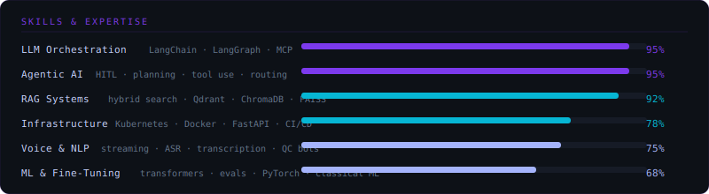
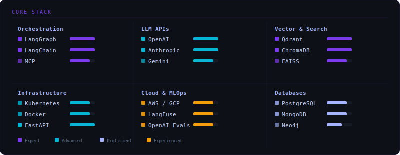

<div align="center">


</div>

<div align="center">

[](https://git.io/typing-svg)

</div>

---

## 👩‍💻 About Me

```python
khushi = {
    "role"        : "AI / ML Engineer",
    "experience"  : "3+ years",
    "focus"       : ["Agentic Systems", "RAG Pipelines", "LLM Orchestration", "HITL Workflows"],
    "shipped"     : "20+ production AI agents — enterprise & healthcare clients",
    "domains"     : ["HIPAA-regulated AI", "Healthcare Tech", "Travel AI", "B2B SaaS"],
    "currently"   : "K8s-sandboxed code execution + AI-powered QA automation @ eClinicalWorks",
    "superpower"  : "End-to-end ownership: infra → agent design → production → stakeholders",
    "writing"     : "Technical content on Medium — LangGraph, RAG, agentic patterns",
    "open_to"     : "Remote Senior/Lead AI Eng roles (US/EU) · IST timezone",
}
```

---

## 🛠 Tech Stack

<div align="center">

**LLMs & Orchestration**


**Vector Stores & Databases**


**Infra & Tooling**


</div>

---

## 🚀 Featured Projects

<table>
<tr>
<td width="50%" valign="top">

### 🧠 SynapseFlow
**Visual Multi-Agent Orchestration Platform**

Built with LangGraph, FastAPI, React, and OpenAI-compatible LLMs. Lets you design, execute, and monitor configurable AI workflows on a graph canvas — with conditional routing, shared memory, inter-agent communication, real-time telemetry, and guardrails. Production-ready from day one.

`LangGraph` `FastAPI` `React Flow` `WebSockets` `OpenAI`

</td>
<td width="50%" valign="top">

### 🔬 Spec Studio
**AI-Powered QA Automation** *(@ eClinicalWorks)*

Transforms DIR requirements → Gherkin test cases using LLMs + hybrid search, validated against 600K+ historical test cases. Saves 35 hours per sprint. Integrates Playwright MCP, Codex Skills, and GitHub Actions for full EMR test automation with artifact generation.

`LangGraph` `Playwright MCP` `Kubernetes` `GitHub Actions` `Healthcare AI`

</td>
</tr>
<tr>
<td width="50%" valign="top">

### 🌐 One Love Innovations
**Autonomous Affiliate Website Platform**

End-to-end multi-agent system using LangGraph that automates the full affiliate website lifecycle: market research → content generation → website development → QA → deployment. Manager-agent architecture with shared memory, Perplexity-powered research, and batch processing — cuts generation latency by ~50%.

`LangGraph` `Manager-Agent` `Perplexity` `Batch Processing`

</td>
<td width="50%" valign="top">

### 🎙 Thomas Cook Voice AI Suite
**Real-Time Voice Agent + QC Bot**

Three-layer AI solution for travel: real-time agent-assist during live calls, a transcript-trained Voice Agent for next-best-action recommendations, and a QC Bot that scores calls against a 32-point checklist with per-agent dashboards. Processed 100+ recorded calls in production.

`Voice AI` `LangChain` `RAG` `Real-Time Streaming` `Dashboards`

</td>
</tr>
<tr>
<td width="50%" valign="top">

### 🔍 Shru.ai
**RAG + Autonomous Web-Crawling Agent**

Autonomously crawls, indexes, and retrieves from live URLs with source attribution and confidence scoring. Built for enterprise knowledge management — resolves hallucination and retrieval failures in production RAG setups.

`RAG` `Web Crawling` `Qdrant` `FastAPI` `Hybrid Search`

</td>
<td width="50%" valign="top">

### 📈 SEO Genie
**AI-Powered SEO Content System**

LLM pipeline using CoT prompting and LangChain that automates keyword analysis, brand-specific content generation, and website audits — achieving 100% SEO scores and a 60% improvement in SEO performance. Includes real-time plagiarism and SEO validation.

`LangChain` `CoT Prompting` `SEO Automation` `Python`

</td>
</tr>
</table>

---

## 📊 Impact by the Numbers

<div align="center">

| | | | | |
|:---:|:---:|:---:|:---:|:---:|
| **20+** | **88%** | **35 hrs** | **60%** | **100+** |
| Production agents shipped | LLM cost reduction | Saved per sprint | Manual effort cut | Calls processed |

</div>

---

## 🧠 Skills & Expertise

<div align="center">
  
</div>

---

## 🛠 Core Stack

<div align="center">
  
</div>

---

## 📝 Latest Writing on Medium

<!-- BLOG-POST-LIST:START -->
> 🖊 I write about agentic AI systems, LangGraph patterns, RAG architecture, and production ML engineering on [Medium →](https://medium.com/@sanghrajkakhushi)
<!-- BLOG-POST-LIST:END -->

*Tip: Add the [blog-post-workflow](https://github.com/gautamkrishnar/blog-post-workflow) GitHub Action to auto-populate this section with your latest articles.*

---

## 🏅 Certifications & Awards

<div align="center">


</div>

---

## 🤝 Let's Connect

<div align="center">

[](https://www.linkedin.com/in/khushi-sanghrajka167428249/)
[](https://medium.com/@sanghrajkakhushi)
[](mailto:sanghrajkakhushi@gmail.com)
[](tel:+919408242295)

</div>

<div align="center">

*Open to Senior / Lead AI Engineer roles at remote-first companies (US/EU) · IST timezone*

*[sanghrajkakhushi@gmail.com](mailto:sanghrajkakhushi@gmail.com)*

</div>

---

<div align="center">


<sub>Built with curiosity · Shipped to production · Always.</sub>

</div>
